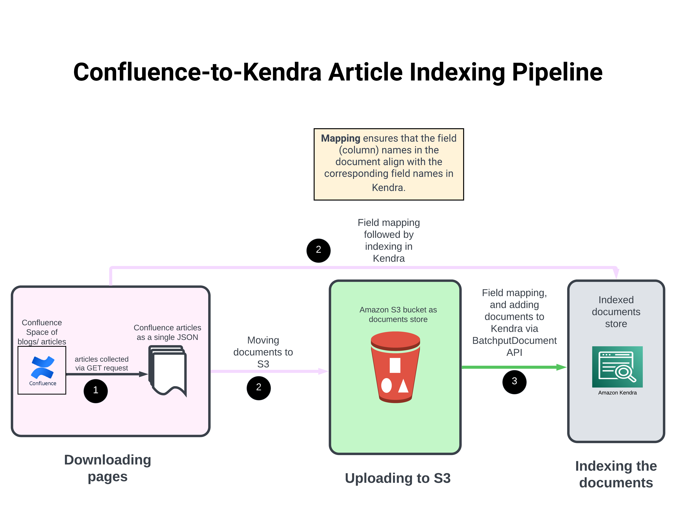

# RAGwithAmazonTitan
A Demo of Retrieval Augmented Generation with Amazon Titan, Bedrock, Kendra, and LangChain. Click on the youtube icon in the architecture diagram below.

### How to launch the application

To be added
